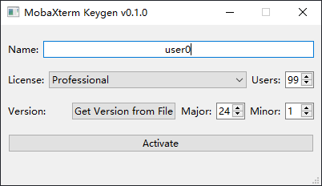
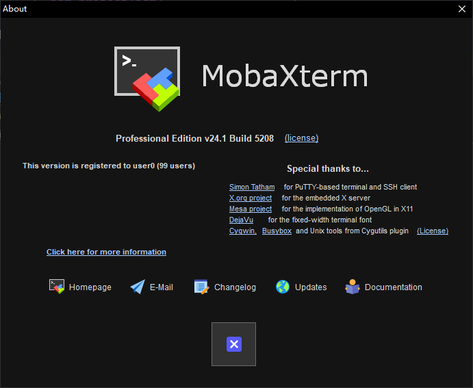

# MobaXterm Keygen GUI

Core algorithm is forked from [MobaXterm-keygen](https://github.com/flygon2018/MobaXterm-keygen).

This GUI is written for me to learn [PySide6](https://doc.qt.io/qtforpython-6/quickstart.html) and [pdm](https://github.com/pdm-project/pdm).



## How it work?

This application creates a `Custom.mxtpro` file for MobaXterm, containing a registration key derived from the user's name and MobaXterm's version.


- __Name__ is taken from Windows user name, or you can input other name.

- __License__ is `Professional` by default, the difference between licenses please refer to [MobaXterm website](https://mobaxterm.mobatek.net/download.html)

- __Users__ means the number of people who can use MobaXterm at the same time.

- __Version ( Major . Minor )__ is the version of MobaXterm, for example, `24.1`. You can click `Get Version from File` to locate the `MobaXterm.exe` file and automatically fit the version, or find the version in the `Help -> About MobaXterm` window of MobaXterm.

## How to use?

0. Clone this repository to your local machine.
1. Python higher than 3.9 is required.
2. Quit MobaXterm if it is running.
3. `pip install -r requirements.txt` or `pdm install` to install required packages.
4. Use the Administrator privilege to run `python start.py`, or you need to copy `Custom.mxtpro` to `C:\Program Files (x86)\Mobatek\MobaXterm` manually.
5. Restart MobaXterm and check the `Help -> About MobaXterm` window.

## Registered Screenshot



## Postscript

1. This application does not have complex activation algorithm and it is truly fantastic. __So please pay for it if possible.__

2. The file generated, `Custom.mxtpro`, is actually a zip file and contains a text file, `Pro.key`, where there is a key string.

3. `MobaXterm.exe` has another mode. You can see it by adding a parameter `"-customizer"`.

   ```
   $ .\MobaXterm.exe -customizer
   ```

   I don't know how to make custom settings take effect in `Customizer` mode directly. 
   
   The only way I found is that you should export custom settings to a file named `MobaXterm customization.custom` which is also a zip file. Then merge two zip file: `Custom.mxtpro` and `MobaXterm customization.custom` to `Custom.mxtpro`. Finally copy newly-generated `Custom.mxtpro` to MobaXterm's installation path.
